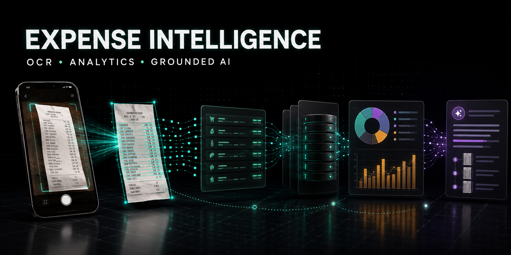
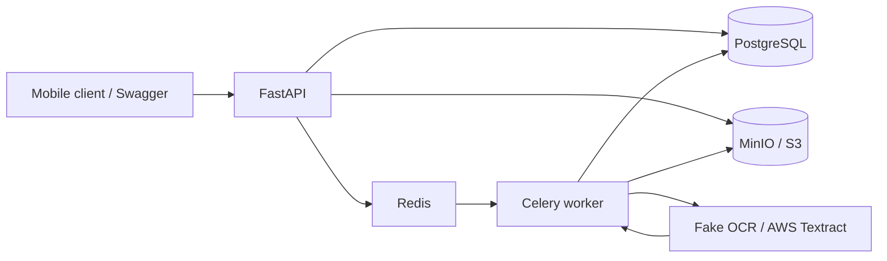

# Expense Intelligence Platform

[](https://github.com/humma-humma/expense-intelligence-platform-portfolio/actions/workflows/ci.yml)



A production-oriented backend for turning German receipt photographs into structured, evidence-traceable expense records. The project demonstrates asynchronous ML-service design today and provides a cost-conscious path toward expense analytics, hybrid retrieval, and a grounded agentic assistant.

> **Current status:** the local Artifact C vertical slice is complete. Real German OCR ingestion is in progress. Analytics and Artifact E capabilities are clearly marked as planned below.

## Architecture



The service is deliberately a modular monolith: one deployable codebase with explicit API, processing, OCR-provider, persistence, and storage boundaries. This keeps a personal deployment inexpensive while preserving clean seams for later scaling.

## Implemented capabilities

- Asynchronous receipt submission, status polling, and result retrieval
- Validated JPEG/PNG uploads with size limits and content-type verification
- SHA-256 duplicate detection and idempotency-key handling
- Durable job metadata in PostgreSQL and artifacts in MinIO/S3
- Celery/Redis background processing with retries and visible failure states
- Pluggable OCR provider boundary with a deterministic fake provider for local development
- AWS Textract response parsing without paid calls during tests
- German monetary-value and date normalization
- Receipt, line-item, validation-warning, and OCR-evidence persistence
- Confidence-based routing to `NEEDS_REVIEW`
- Liveness and dependency-aware readiness endpoints
- Multi-stage, non-root Docker image and a five-service Compose stack
- Strict typing, linting, migrations, and automated tests with **93%+ coverage**

## Planned product scale

The roadmap extends the same service into a personal expense-intelligence application:

- Mobile PWA capture, correction workflow, category taxonomy, and interactive spending dashboards
- Structured logs, metrics, traces, backup/restore exercises, and hardened failure handling
- PostgreSQL full-text search plus `pgvector` hybrid retrieval over confirmed receipt evidence
- A typed router across SQL analytics, receipt lookup, semantic search, chart generation, and external tools
- Grounded answers with verified citations, abstention on missing evidence, and trajectory/cost logging
- Preview/approve/execute boundaries for recategorization, export, and other mutations
- GitHub Actions build/deploy pipeline and an economical AWS deployment
- Local Kubernetes exercise followed by Terraform only after manual cloud deployment works

See [PLAN.md](PLAN.md) for phased gates, evaluation criteria, security boundaries, and cost controls.

## API workflow

```text
POST /api/v1/receipts
        |
        v
GET  /api/v1/jobs/{job_id}
        |
        v
GET  /api/v1/jobs/{job_id}/result
```

Jobs progress through durable states such as `QUEUED`, `PROCESSING`, `RETRYING`, `FAILED`, `NEEDS_REVIEW`, and `CONFIRMED`.

## Run locally

### Docker Compose

```bash
docker compose up --build
```

Then open:

- Swagger/OpenAPI: <http://localhost:8000/docs>
- Liveness: <http://localhost:8000/health/live>
- Readiness: <http://localhost:8000/health/ready>
- MinIO console: <http://localhost:9001>

The Compose environment uses development-only credentials and fake OCR by default, so the vertical slice incurs no cloud OCR cost.

### Python development

Requirements: Python 3.12 or 3.13 and [uv](https://docs.astral.sh/uv/).

```bash
cp .env.example .env
uv sync --dev --locked
uv run uvicorn expense_intelligence.main:app --reload
```

On PowerShell, use `Copy-Item .env.example .env` instead of `cp`.

## Quality checks

```bash
uv run ruff check src tests migrations
uv run ruff format --check src tests migrations
uv run mypy
uv run pytest --cov --cov-report=term-missing
```

GitHub Actions runs these checks for pull requests and pushes to `main`. Paid OCR calls are excluded from ordinary CI; sanitized provider responses are replayed instead.

## Cost and privacy principles

- No OCR training or fine-tuning unless managed OCR proves insufficient
- Fake OCR by default and at most one normal provider call per new receipt
- PostgreSQL/pgvector instead of a separate managed vector database
- Local infrastructure first; managed AWS services are temporary evaluation targets
- No personal receipt image, raw private provider response, `.env` file, or credential belongs in Git

Read the [test-data policy](docs/security/test-data-policy.md) before adding fixtures. The included OCR fixture is sanitized and synthetic.
